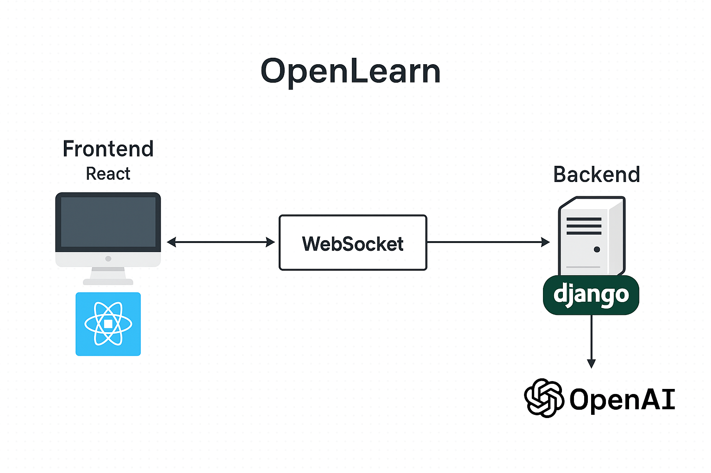

# 📘 OpenLearn

**OpenLearn** is a smart education platform where students can learn **Physics, Chemistry, Math, Biology**, and **English Speaking** with the help of AI-powered teachers and interactive tools like digital labs and a visual periodic table. It’s designed to make learning simple, visual, and voice-interactive.

---

## 🚀 Features

- 🧠 **AI Teacher (STEM Subjects)**  
  Get instant guidance from an AI teacher (with voice support) for **Physics, Chemistry, Math**, and **Biology**.

- 💬 **English Speaking Practice**  
  Practice spoken English with a voice-based AI teacher that helps you improve fluency, pronunciation, and vocabulary.


- 🧲 **Interactive Periodic Table**  
  Click any element to view a **Bohr-Rutherford atomic model**, with electrons orbiting in real time around the nucleus.

- 🧩 **Gamified Learning Experience**  
  Earn rewards and track your learning progress through levels and achievements.

- 🔊 **Voice Interaction**  
  Communicate directly with your AI tutor through microphone in real time.

- 📈 **Progress Tracking**  
  Automatically track your completed lessons and performance improvements.

---

## 🌟 Why OpenLearn?

OpenLearn stands out by offering:

- Voice-based AI teaching for science subjects
- Real-time interactive tools like atomic simulations
- Multisensory learning that combines visuals, voice, and gamification
- Personalized learning without expensive tutors

OpenLearn empowers every student to understand complex topics through **visual models**, **interactive elements**, and **intelligent conversations**.

---

## 🗺️ System Architecture

Here’s how OpenLearn is structured behind the scenes:



> - **Frontend**: Built with React  
> - **Backend**: Powered by Django  
> - **Communication**: Real-time via WebSocket  
> - **AI Services**: Integrated using OpenAI APIs

---

## 📺 Demo Video

▶️ Watch the platform in action:  
[](https://www.youtube.com/watch?v=HpaGVI8ubac)

---

## 🌐 Live Demo

Try OpenLearn here:  
🔗 [https://openlearn.pages.dev/](https://openlearn.pages.dev/)

---

## 🛠️ Tech Stack

| Layer        | Technology                      |
|--------------|----------------------------------|
| Frontend     | React, Tailwind CSS              |
| Backend      | Django                           |
| Real-Time    | WebSocket (Django Channels)      |
| AI & Voice   | OpenAI, Whisper, Coqui TTS       |
| Animation    | Three.js, D3.js (for simulations)|
| Database     | PostgreSQL                       |
| Hosting      | Linode,Netlify    |

---

## 📦 Installation

```bash
git clone https://github.com/your-username/OpenLearn.git
cd OpenLearn

# Setup Frontend
cd frontend
npm install
npm run dev
# Setup Backend
cd ../backend
cd ITHackathon
pip install -r requirements.txt

python3.11 -m daphne -b 0.0.0.0 -p 8000 ITHackathon.asgi:application
